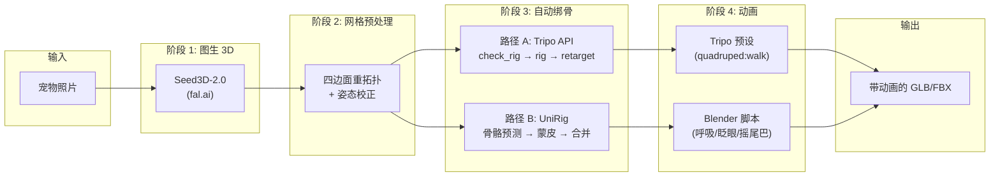

# 宠物照片 → 带动画 3D 模型 — PoC 方案

## 架构总览



---

## 阶段 1：图生 3D — Seed3D-2.0 via fal.ai

**为什么选 Seed3D-2.0：** 输出封闭流形网格（watertight manifold），带 PBR 材质，中等细分约 10 万面，完整 UV + 漫反射/金属度/粗糙度贴图。单张图片能拿到的最干净网格，直接降低后续绑骨失败率。

**接口：** `fal-ai/bytedance/seed3d/image-to-3d`
- 成本：约 $0.33/次
- 输出：带 PBR 纹理的 GLB
- 配置：`subdivisionlevel=medium`，`fileformat=glb`

```python
import fal_client

result = fal_client.subscribe("fal-ai/bytedance/seed3d/image-to-3d", arguments={
    "image_url": photo_url,
})
mesh_url = result["model_mesh"]["url"]
```

**核心风险：** Seed3D-2.0 会按照输入照片的姿态生成模型。蜷缩的猫、坐着的狗不会是绑骨友好的站立姿态，必须在阶段 2 处理。

---

## 阶段 2：网格预处理（最容易翻车的衔接层）

这是大多数 demo 跳过的步骤，也是实际失败的主要来源。阶段 1 的网格需要：

1. **四边面重拓扑（Quad Remeshing）** — 转为干净的四边面主导拓扑，目标 1-3 万面
2. **姿态校正为站立姿态** — 四足自动绑骨工具假设输入是中立站姿、四肢分开

### 方案：fal.ai 上的 Tripo 端点（PoC 推荐）

直接在 fal.ai 内部调用 Tripo 的图生3D 端点并开启 `quad=true`，这样阶段 1 输出的模型 URL 可以直接传给 Tripo 端点做重拓扑，**无需跨平台上传文件**。Seed3D + 重拓扑共用同一个 `FAL_KEY`。

```python
import fal_client

# 阶段 1 的输出 mesh_url 直接传入
result = fal_client.subscribe("tripo3d/tripo/v2.5/image-to-3d", arguments={
    "image_url": photo_url,   # 或直接用原图让 Tripo 也生成一版做对比
    "quad": True,             # 开启四边面重拓扑
    "face_limit": 10000,      # 目标面数
    "texture": True,
    "pbr": True,
})
remeshed_url = result["model_mesh"]["url"]
```

成本：fal.ai 上 Tripo 生成 + quad remesh 约 $0.05-0.10（按 token 计费，比 Tripo 官方的 30 credits 便宜）。

> **备选方案：** 如果需要更精细控制，可用 Blender 无头模式（`blender --background --python`）配合 Instant Meshes 或 QuadriFlow 做本地重拓扑。

### PoC 阶段的务实决策：

PoC 阶段**约束输入照片** — 要求测试者提供宠物站立、四肢可见的照片。这样完全绕过姿态校正问题，让我们可以单独验证绑骨质量。姿态校正作为 PoC 后的投入项记录。

---

## 阶段 3：自动绑骨 — 两条并行路径

### 路径 A：Tripo API（快速、可预期）

三个串行 API 调用：

```python
# 1. 检查模型是否可绑骨
check = tripo.check_riggable(original_model_task_id=model_task_id)
# 返回: riggable=True/False, rig_type="quadruped"

# 2. 自动绑骨
rig = tripo.rig_model(
    original_model_task_id=model_task_id,
    out_format="glb",
    rig_type=RigType.QUADRUPED,
    spec=RigSpec.TRIPO,  # 或 MIXAMO
)

# 3. 重定向预设动画
anim = tripo.retarget_animation(
    original_model_task_id=model_task_id,
    animation=Animation.QUADRUPED_WALK,
    out_format="glb",
    bake_animation=True,
)
```

- 成本：绑骨 25 credits（$0.25）+ 重定向免费（Beta 期间）
- 四足预设动画：目前仅有 `quadruped:walk`
- 输出：带烘焙骨骼 + 动画的 GLB/FBX

### 路径 B：UniRig 自部署（质量天花板更高）

三步 CLI 流水线：

```bash
# 1. 骨骼预测
bash launch/inference/generate_skeleton.sh \
  --input pet_model.glb --output pet_skeleton.fbx

# 2. 蒙皮权重预测
bash launch/inference/generate_skin.sh \
  --input pet_skeleton.fbx --output pet_skin.fbx

# 3. 合并回原始网格
bash launch/inference/merge.sh \
  --source pet_skin.fbx --target pet_model.glb --output pet_rigged.glb
```

- 要求：CUDA GPU，8GB+ 显存，Python 3.11
- 成本：仅 GPU 时间（云 GPU 约 $0.10-0.30/模型）
- 无预设动画 — 需在阶段 4 单独生成
- 训练集 Rig-XL 包含 14,000+ 模型（显式覆盖四足动物）— 对宠物场景理论质量最优

**PoC 部署方式：** 在云 GPU 实例（RunPod / Vast.ai / Lambda）上用 A10G 或 L4 GPU，封装为简单的 FastAPI 服务。

---

## 阶段 4：动画 — 情感化待机动作

这是宠物追忆产品差异化的核心。关键洞察：用户要的是"看起来它还在" — 细腻的类生命待机动画，不是跑跳打斗。

### MVP 目标动画：

- **呼吸**（P0）— 程序化生成，胸腔骨骼正弦波缩放
- **眨眼**（P0）— 程序化生成，眼睑形态键（Shape Keys）
- **尾巴轻摇**（P0）— 程序化生成，尾巴骨骼链正弦波旋转
- **歪头 / 看向镜头**（P1）— 程序化生成，头部骨骼 IK 目标
- **坐下↔站起过渡**（P2）— 预设动画或 mocap 重定向
- **行走循环**（P2）— Tripo `quadruped:walk` 预设

### 实现方式：Blender Python 无头脚本

编写一组 Blender Python 脚本，输入绑好骨的 GLB，烘焙程序化动画：

```python
import bpy, math

def add_breathing(armature, duration_frames=120, intensity=0.03):
    chest_bone = armature.pose.bones["Spine1"]  # 或等价骨骼
    for frame in range(duration_frames):
        t = frame / duration_frames
        scale_y = 1.0 + math.sin(t * 2 * math.pi) * intensity
        chest_bone.scale = (1.0, scale_y, 1.0)
        chest_bone.keyframe_insert(data_path="scale", frame=frame)
```

脚本必须**与骨骼命名无关** — 通过层级位置自动检测胸腔/尾巴/头部骨骼，因为 Tripo（`RigSpec.TRIPO`）和 UniRig 产生的骨骼命名规范不同。

### 备选方案：Truebones Zoo 免费动画库

从 https://gumroad.com/truebones 下载 — 包含 70+ 物种的 FBX 动画。用 Blender NLA 编辑器将狗/猫动画重定向到我们的模型上。适合运动类动画，对细腻待机动画帮助有限。

---

## 项目结构

```
furever-3d-rigging-poc/
  README.md
  requirements.txt
  .env.example                  # API Key 模板
  config.py                     # 管线配置（接口地址、参数）

  pipeline/
    __init__.py
    stage1_image_to_3d.py       # Seed3D-2.0 via fal.ai
    stage2_mesh_prep.py         # fal.ai Tripo 端点做四边面重拓扑
    stage3a_rig_tripo.py        # Tripo 自动绑骨路径
    stage3b_rig_unirig.py       # UniRig 自部署路径
    stage4_animate.py           # 动画编排器
    run_pipeline.py             # 端到端 CLI 运行器

  animation/
    blender_breathing.py        # Blender 无头脚本：呼吸
    blender_blink.py            # Blender 无头脚本：眨眼
    blender_tail_wag.py         # Blender 无头脚本：摇尾巴
    blender_idle_composite.py   # 组合所有待机动画
    bone_detector.py            # 自动检测骨骼角色（从层级推断）

  evaluation/
    eval_suite.py               # 批量评估运行器
    score_card.py               # 四维度评分（骨架/蒙皮/末端/关节）
    compare_paths.py            # A vs B 对比报告

  test_assets/
    photos/                     # 10-20 张测试宠物照片
    results_tripo/              # 路径 A 输出
    results_unirig/             # 路径 B 输出

  deploy/
    Dockerfile.unirig           # UniRig GPU 服务容器
    docker-compose.yml
    api_server.py               # FastAPI 封装完整管线
```

---

## 按周执行计划

### 第 1 周：验证 API 路径（Tripo 端到端）

- 搭建项目骨架和配置
- 实现 `stage1_image_to_3d.py`：Seed3D-2.0 via fal.ai
- 实现 `stage2_mesh_prep.py`：fal.ai Tripo 端点做四边面重拓扑
- 实现 `stage3a_rig_tripo.py`：check_rig + rig + retarget
- 跑 10 张测试照片通过完整 Tripo 管线
- 记录：成功率、每步耗时、总成本、输出质量
- **交付物：** 10 个带 `quadruped:walk` 动画的绑骨 GLB 文件 + 成本表

### 第 2 周：验证自部署路径（UniRig）+ 待机动画

- 在云 GPU 上部署 UniRig（RunPod A10G 或同级）
- 实现 `stage3b_rig_unirig.py` 封装三步 CLI
- 用同样 10 张照片跑 UniRig 路径
- 编写 Blender 无头脚本：呼吸 + 眨眼 + 摇尾巴
- 对 Tripo 和 UniRig 两条路径的绑骨模型分别应用待机动画
- **交付物：** 每条路径 10 个带待机动画的绑骨 GLB 文件 + 质量对比

### 第 3 周：评估 + 决策

- 运行 `eval_suite.py` 对所有输出做四维度评分
  - 骨架放置准确度（骨骼位置对不对？）
  - 蒙皮形变质量（变形自然不自然？）
  - 末端处理（尾巴、耳朵、爪子 — 正常还是崩坏？）
  - 关节弯曲方向（膝盖弯对方向没？）
- 对比成本结构：
  - Tripo 路径：约 $0.71/模型（Seed3D $0.33 + 重拓扑 $0.08 + 绑骨 $0.25 + 动画 $0.05）
  - UniRig 路径：约 $0.66/模型（Seed3D $0.33 + 重拓扑 $0.08 + GPU $0.15 + 动画 $0.10）
- 基于质量门槛和规模经济性做出选择
- **交付物：** 决策文档（含评分矩阵、10K/100K MAU 成本预测）

---

## 关键风险与应对

- **Seed3D 输出非站立姿态** → 绑骨直接失败 → PoC 阶段约束输入照片；PoC 后投入姿态校正
- **UniRig 骨骼遗漏尾巴/耳朵** → 待机动画崩坏 → 加人工审查步骤；回退到 Tripo
- **Tripo 四足绑骨对 AI 生成网格质量差** → 形变不可接受 → UniRig 兜底；增加网格清理步骤
- **Blender 待机脚本无法识别未知骨骼命名** → 脚本崩溃 → 构建骨骼角色检测器，按层级位置映射
- **fal.ai Seed3D-2.0 可用性问题** → 管线阻塞 → 火山引擎作为备用（需中国区账号）

---

## 单模型成本预估

- **Seed3D-2.0（fal.ai）** — Tripo 路径 $0.33 / UniRig 路径 $0.33
- **四边面重拓扑（fal.ai Tripo 端点）** — Tripo 路径约 $0.08 / UniRig 路径约 $0.08
- **自动绑骨** — Tripo 路径 $0.25（Tripo 官方 API）/ UniRig 路径约 $0.15（GPU）
- **动画重定向** — Tripo 路径免费（Beta）/ UniRig 路径约 $0.05（GPU）
- **待机动画生成** — Tripo 路径约 $0.05（GPU）/ UniRig 路径约 $0.05（GPU）
- **合计** — **Tripo 路径约 $0.71** / **UniRig 路径约 $0.66**

按 100K MAU（假设每用户 1 个模型）：每月仅生成成本约 $66K-71K。重拓扑改走 fal.ai 后每个模型省了约 $0.22。自部署 UniRig 在规模化后单位经济性更优 — 随 GPU 成本摊薄，差距会进一步拉大。

---

## 需要准备的 API Key

- **`FAL_KEY`**（必须，第 1 周）— 注册 https://fal.ai/dashboard — 用于 Seed3D-2.0 图生3D + Tripo 重拓扑，一个 key 搞定两件事
- **`TRIPO_API_KEY`**（必须，第 1 周）— 注册 https://platform.tripo3d.ai — 仅用于绑骨（auto-rig）和动画重定向（retarget），这两个接口目前只有 Tripo 官方提供
- **云 GPU 平台账号**（第 2 周）— RunPod / Vast.ai / Lambda 三选一，用于部署 UniRig
